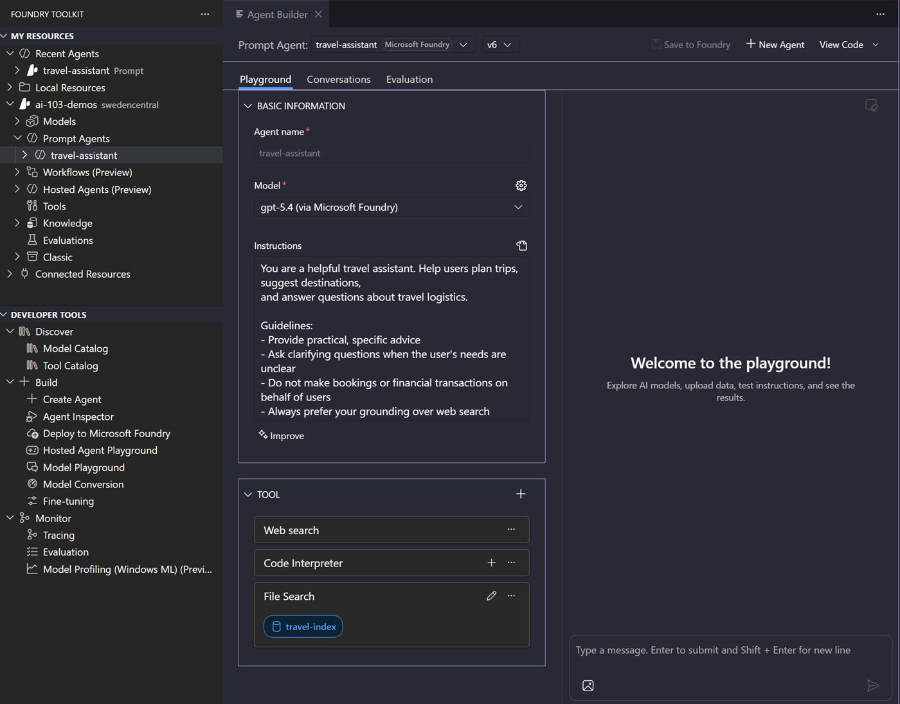

# Develop AI agents with Microsoft Foundry and Visual Studio Code

https://learn.microsoft.com/en-us/training/modules/develop-ai-agents-azure-vs-code/

---

## Instructor Demo Guide

Live walkthrough of building, configuring, testing, and deploying an AI agent using the Microsoft Foundry portal. Students do the same steps themselves in the exercise afterward.

**Estimated time:** 30–40 minutes

---

## Prerequisites

- Azure subscription with a Microsoft Foundry project provisioned
- A GPT-5.4 model deployment ready in the project (Global Standard)
- VS Code with the **Microsoft Foundry** extension installed and signed in
- Browser tab open to [https://ai.azure.com](https://ai.azure.com)
- Grounding documents from [`assets/`](assets/) downloaded locally:
  - [`europe-destinations.md`](assets/europe-destinations.md) — destination guide with climate, budget, and logistics info
  - [`travel-faq.md`](assets/travel-faq.md) — common travel Q&A (booking, packing, safety, accommodation)

---

## Step 1 — Orient students to the Foundry Agent UI

Open [https://ai.azure.com](https://ai.azure.com), sign in, and navigate to **Build > Agents**.

Create a new agent named `travel-assistant`. The portal opens the agent editor — point out the two-panel layout:

- **Left panel** — the agent's configuration: Model, Voice mode, Instructions, Tools, Knowledge, Memory, Guardrail
- **Right panel** — the live Chat playground with **Chat / YAML / Call agent** tabs

> **Talking point:** "Everything is in one view. You configure on the left and immediately test on the right — there's no separate playground to navigate to. As you add instructions or tools on the left, you can test the effect on the right straight away."

---

## Step 2 — Select the model

In the **Model** field at the top of the left panel:

1. Click the model dropdown — select the `gpt-5.4` deployment
2. Leave the deployment type as **Global Standard**

> **Talking point:** "Global Standard routes requests across Azure regions for higher throughput and availability. For a demo that's fine — in production you'd choose the region closest to your users."

---

## Step 3 — Add instructions

Click the **Instructions** section to expand it. Paste:

```
You are a helpful travel assistant. Help users plan trips, suggest destinations,
and answer questions about travel logistics.

Guidelines:
- Provide practical, specific advice
- Ask clarifying questions when the user's needs are unclear
- Do not make bookings or financial transactions on behalf of users
- Always prefer your grounding over web search
```

> **Talking point:** "Instructions are the system prompt — the contract the agent works from. Good instructions have a role, a list of responsibilities, and explicit boundaries. The boundary here is 'do not make bookings' — we'll test that in a moment."

---

## Step 4 — Test in the Chat panel

The **Chat** tab on the right is already active. Send two messages:

1. `I want to visit somewhere warm in Europe in October. Any suggestions?`
2. `Can you book the flight for me?`

> **Talking point:** "The second message is boundary testing — always do this before adding tools or publishing. The agent should decline politely. Notice the token counts and model name shown below each response."

---

## Step 5 — Add Code Interpreter

In the left panel, expand the **Tools** section:

1. Click the **Add** dropdown — a "Most popular" list appears with toggles
2. Toggle on **Code interpreter** (turns purple)
3. In the Chat panel, send: `What is the exchange rate impact if I convert $1000 USD to EUR at 0.92?`
4. The agent invokes Code Interpreter and returns the precise calculation

> **Talking point:** "The model decided to use Code Interpreter — we didn't tell it to. It saw the tool was available and chose it for a maths question. This is automatic tool calling — the agent picks the right tool for each task."

---

## Step 6 — Add File Search (grounding documents)

Still in the **Tools** section:

1. Click **Upload files** — the **Attach files** modal opens
2. Set **Index option** to `Create a new index`
3. Set **Vector index name** to `travel-index`
4. Drag and drop (or click **browse for files**) and select both files from `assets/`:
   - `europe-destinations.md`
   - `travel-faq.md`
5. Click **Attach** and wait for indexing to complete
6. Send: `What are the best European destinations to visit in October on a mid-range budget?`
7. Point out the citation references in the response

> **Talking point:** "The vector index is what makes search semantic rather than keyword-based. The documents get chunked, embedded, and stored so the agent can find relevant passages even when the user's wording doesn't exactly match the text. Notice it cites which document it pulled from — that's what grounds the answer and prevents hallucination."

---

## Step 7 — Show the YAML tab

Click the **YAML** tab in the right panel. Walk through the agent definition:

- `name`, `description`, `model`
- `instructions` block
- `tools` list showing `code_interpreter`
- `knowledge` block showing the vector store reference

> **Talking point:** "This YAML is the agent's source of truth. You can copy it into source control and deploy the same agent in another project or environment. Every change you make in the left panel is immediately reflected here — and you can edit the YAML directly if you prefer."

---

## Step 8 — Foundry Toolkit for VS Code

The same agent you just built in the portal is immediately accessible in VS Code through the **Foundry Toolkit** extension.

> **Install:** [Foundry Toolkit — Visual Studio Marketplace](https://marketplace.visualstudio.com/items?itemName=ms-windows-ai-studio.windows-ai-studio)



Switch to VS Code and open the **Foundry Toolkit** panel (sidebar icon). Point out the three sections:

**MY RESOURCES**
- **Recent Agents** — `travel-assistant` appears here immediately after saving in the portal
- Expand your Foundry project to see **Models**, **Prompt Agents**, **Workflows**, **Hosted Agents**, **Tools**, **Knowledge**, **Evaluations**

**DEVELOPER TOOLS**
| Sub-section | What you can do |
|---|---|
| Discover → Model Catalog | Browse and evaluate models from Foundry, OpenAI, Anthropic, Google, GitHub |
| Discover → Tool Catalog | Find tools to add to agents |
| Build → Create Agent | Start a new agent without leaving VS Code |
| Build → Agent Inspector | Debug agent behaviour step by step |
| Build → Deploy to Microsoft Foundry | Push a locally-built agent to the Foundry service |
| Build → Model Playground | Test any model interactively |
| Build → Fine-tuning / Model Conversion | Adapt or convert models for local/NPU deployment |
| Monitor → Tracing | Inspect tool calls and token usage per turn |
| Monitor → Evaluation | Run datasets against the agent and score results |

Click **`travel-assistant`** under Prompt Agents → the **Agent Builder** opens on the right, showing the same `gpt-5.4` model, instructions, and all three tools (Web search, Code interpreter, File search with `travel-index`) that were configured in the portal.

> **Talking point:** "The portal and VS Code are two views of the same agent definition. Designers and product managers can work in the portal; developers stay in VS Code. Both tools write to the same Foundry project — there's no sync step, no export, no duplication. You can also use Save to Foundry from the Agent Builder to push any changes made here back to the service."

---

## Step 9 — Generate integration code

In VS Code with the **Foundry Toolkit** open:

1. Right-click `travel-assistant` under Prompt Agents → **View Code**
2. Show the generated integration code for connecting an application to the agent

> **Talking point:** "The 'View Code' option generates the boilerplate to authenticate, send a message, and read the response — everything you need to embed this agent in a web app, API, or background service. Your application stays thin; all the intelligence stays in the Foundry service."

---

## Step 10 — Save and Publish

Back in the portal:

1. Click **Save** (top right) — saves the current version to your Foundry project; note the **Version** label (e.g. `Version: 3 (Today 2:21 PM)`)
2. Click **Publish** (top right) to create a callable external endpoint
3. Show the resulting endpoint URL format:
   ```
   https://<resource>.services.ai.azure.com/api/projects/<project>/applications/<app>/protocols/openai/responses
   ```

> **Talking point:** "Save keeps the agent inside your project — visible to your team, testable in the portal. Publish creates a stable HTTPS endpoint external applications can call. The version history means you can roll back to any saved state."

---

## Summary

| What was shown | Concept |
|---|---|
| Two-panel agent editor | Configure left, test right — no separate navigation |
| Model selection (GPT-5.4, Global Standard) | Deployment type affects routing and availability |
| Instructions with boundaries | System prompt as behaviour contract |
| Code Interpreter (Add toggle) | Automatic tool calling for computation |
| File Search + vector index | RAG — documents the agent searches before responding |
| YAML tab | Agent definition as text — portable, version-controllable |
| Foundry Toolkit (VS Code extension) | Portal and VS Code as two views of the same agent |
| View Code | Generated integration boilerplate from VS Code |
| Save vs Publish | Project-scoped vs externally callable endpoint |

Students will now complete the same steps in the exercise lab.
