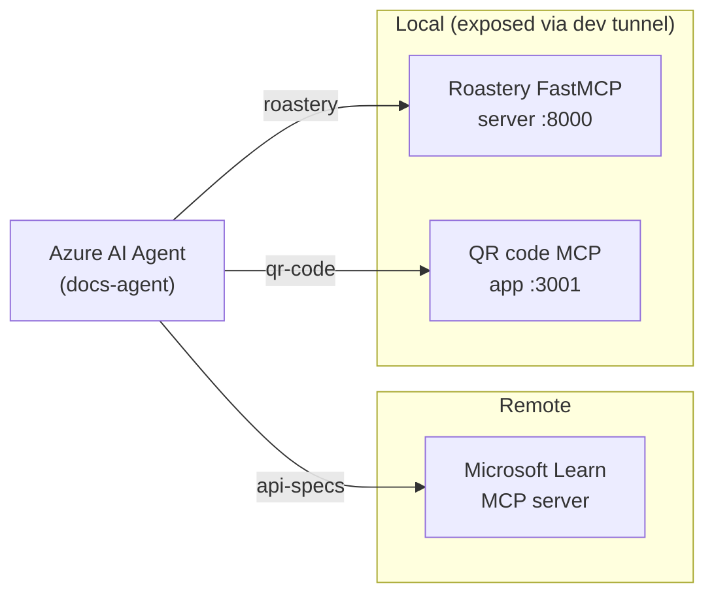

# Integrate MCP Tools with Azure AI Agents

https://learn.microsoft.com/en-us/training/modules/connect-agent-to-mcp-tools/

---

## Instructor Demo Guide

This demo shows how to connect Azure AI Agents to Model Context Protocol (MCP) servers so that agents can discover and call tools dynamically at runtime. A single agent talks to **three** MCP servers at once: a **remote** server (Microsoft Learn), a **local** custom server (the roastery FastMCP server), and a **standalone** MCP app (the [`qr-server/`](qr-server/) QR code generator). The live example is an **artisan coffee roastery inventory** assistant that also answers documentation questions and generates QR codes.



A complete, runnable solution lives next to this guide in [`mcp-coffee-py/`](mcp-coffee-py/) — you don't need to clone the lab repo to run it.

**Estimated time:** 25–35 minutes

---

### Prerequisites

- Python 3.12 or 3.13 on the PATH
- An active Azure subscription with a Foundry project and a chat model deployed (e.g. `gpt-4.1`)
- The Azure CLI, signed in: `az login` (the demo uses `DefaultAzureCredential`)
- The **dev tunnels CLI** (`devtunnel`) on the PATH — the custom servers are exposed to the Foundry cloud through a tunnel. Install it:
  - Windows: `winget install Microsoft.devtunnel`
  - macOS: `brew install --cask devtunnel`
  - Linux: `curl -sL https://aka.ms/DevTunnelCliInstall | bash`
- Demo working directory: [`mcp-coffee-py/`](mcp-coffee-py/)

This demo's Foundry project endpoint:

```
https://ai-103-demos-resource.services.ai.azure.com/api/projects/ai-103-demos
```

### One-time setup

**Fastest path — one command.** From this folder, [`run.ps1`](run.ps1) (Windows) or [`run.sh`](run.sh) (Linux/macOS) creates both virtual environments, installs dependencies, starts both local MCP servers, creates and hosts the dev tunnel, writes the tunnel URLs into `mcp-coffee-py/.env`, and launches the agent:

```powershell
.\run.ps1
```

```bash
./run.sh
```

To set things up by hand instead, work from the [`mcp-coffee-py/`](mcp-coffee-py/) folder:

```powershell
python -m venv .venv
.venv\Scripts\Activate.ps1
pip install -r requirements.txt
copy .env.example .env   # then edit .env if your deployment name differs
az login
```

`.env` already points `PROJECT_ENDPOINT` at the demo project above. Set `MODEL_DEPLOYMENT_NAME` to match your deployment.

The demo folder contains:

- [`agent.py`](mcp-coffee-py/agent.py) — connects an agent to MCP servers **by URL** with `MCPTool`: a **remote** server (Microsoft Learn) plus two **custom** servers (the roastery `server.py` and the standalone `qr-server`), reached over dev tunnels
- [`server.py`](mcp-coffee-py/server.py) — the **custom** roastery FastMCP server (stdio for the hand-written client, `--http` to expose it by URL)
- [`client.py`](mcp-coffee-py/client.py) — a **hand-written** MCP client that launches the custom server over stdio, discovers its tools, and wires them to an agent
- [`requirements.txt`](mcp-coffee-py/requirements.txt) — Azure AI Projects SDK, `azure-identity`, `openai`, `mcp`, `fastmcp`, `python-dotenv`

The standalone [`qr-server/`](qr-server/) app (its own folder and `requirements.txt`) is a third **custom** MCP server reached by URL. It is not modified by the demo — `agent.py` only reaches it over a public HTTPS URL.

---

### Step 1 — Concepts: why MCP?

Open the module page and walk through the core problem.

- Without MCP, every new tool requires manual coding and a redeployment.
- MCP provides an "integrate once" server that agents query at runtime to discover what tools are available.

> **Talking point:** "Think of the MCP server as a live tool catalog. The agent doesn't know what's in the catalog ahead of time — it asks at runtime. This means you can add or update tools on the server without touching the agent code."

Draw (or show a slide of) the three-layer pipeline:

```
MCP Server  →  exposes tools with @mcp.tool
MCP Client  →  calls session.list_tools(), wraps each as an async function
Azure AI Agent  →  receives FunctionTool definitions, calls tools via natural language
```

> **Talking point:** "There are two ways to bring MCP tools to an agent. **Connect by URL**: point the SDK's `MCPTool` at a server's URL — no client code, and it works the same whether that server is a *remote* third-party one like Microsoft Learn or your own *custom* server exposed over HTTPS. **Build your own**: write a custom MCP server and the client glue yourself, talking to it over stdio."

---

### Step 2 — Connect an agent to remote and custom MCP servers ([`agent.py`](mcp-coffee-py/agent.py))

`agent.py` attaches **three** MCP servers to a single agent: the remote Microsoft Learn server, the local roastery server from [`server.py`](mcp-coffee-py/server.py), and the standalone [`qr-server`](qr-server/) (kept as its own app). Because the Foundry service calls each `server_url` **from the cloud**, the two local servers must be reachable over **public HTTPS** — so we run them over HTTP and expose them with Azure dev tunnels.

**Start both local servers.** In one terminal, start the roastery server over HTTP (`http://127.0.0.1:8000/mcp`):

```powershell
python server.py --http
```

In a second terminal, start the standalone QR server (`http://0.0.0.0:3001/mcp`):

```powershell
cd ..\qr-server
pip install -r requirements.txt
python server.py
```

**Expose both ports.** In a third terminal, host one dev tunnel that forwards both ports, then copy the two HTTPS URLs:

```powershell
devtunnel user login
devtunnel host -p 8000 -p 3001 --allow-anonymous
```

Set the two URLs in `.env` **with the `/mcp` path appended**, for example:

```
ROASTERY_MCP_URL="https://abc123-8000.euw.devtunnels.ms/mcp"
QR_MCP_URL="https://abc123-3001.euw.devtunnels.ms/mcp"
```

Now open [`agent.py`](mcp-coffee-py/agent.py) and walk through the key sections.

**a. Authenticate and create the AI project client** — same convention as the rest of the repo:

```python
with (
    DefaultAzureCredential(
        exclude_environment_credential=True,
        exclude_managed_identity_credential=True,
    ) as credential,
    AIProjectClient(endpoint=project_endpoint, credential=credential) as project_client,
    project_client.get_openai_client() as openai_client,
):
```

**b. Create three `MCPTool` objects** — the remote Learn server, the local roastery server (`ROASTERY_MCP_URL`), and the standalone QR server (`QR_MCP_URL`):

```python
docs_mcp_tool = MCPTool(
    server_label="api-specs",
    server_url="https://learn.microsoft.com/api/mcp",
    require_approval="always",
)

roastery_mcp_tool = MCPTool(
    server_label="roastery",
    server_url=roastery_mcp_url,
    require_approval="always",
)

qr_mcp_tool = MCPTool(
    server_label="qr-code",
    server_url=qr_mcp_url,
    require_approval="always",
)
```

> **Talking point:** "One agent, three MCP servers — a public third-party one, our roastery server, and a standalone QR app. The agent treats them identically; it just sees more tools in the catalog. `require_approval='always'` means each tool call pauses and returns an `mcp_approval_request` our code must answer before the tool runs. Set it to `'never'` and the agent invokes tools automatically with no sign-off."

**c. Create the agent with all three MCP tools attached** (`tools=[docs_mcp_tool, roastery_mcp_tool, qr_mcp_tool]`) and drive it through the responses API. When the run returns `mcp_approval_request` items, the demo auto-approves the `api-specs`, `roastery`, and `qr-code` server labels and sends the approvals back to get the final answer.

Run it:

```powershell
python agent.py
```

The demo presents a **three-option menu**, one question per MCP server — press Enter to accept option 1 (the default):

```
Choose a question:
  Press 1 for the QR code server (generate a QR code)
  Press 2 for the roastery server (Espresso Blend stock)
  Press 3 for the Microsoft Learn server (FastMCP docs)
```

Run each option in turn to exercise all three servers — the QR request routes to the standalone QR app, the stock question to the custom roastery server, and the docs question to the remote Microsoft Learn server.

> **Talking point:** "Same agent, same approval flow for all three. The agent picks the right tool from whichever server fits the question — it discovered every server's tools at runtime, none of it was baked in. That's dynamic tool discovery across remote and custom servers alike."

The script handles **Ctrl+C** gracefully — it always deletes the agent version and conversation on the way out, even if you interrupt mid-run.

---

### Step 3 — Build a custom MCP server ([`server.py`](mcp-coffee-py/server.py))

Open [`server.py`](mcp-coffee-py/server.py). This is the roastery backend — two tools published with the `@mcp.tool()` decorator:

```python
mcp = FastMCP(name="Roastery")

@mcp.tool()
def get_bean_inventory() -> dict:
    """Returns current stock levels (in 1 kg bags) for every coffee SKU in the roastery."""
    return {
        "Ethiopia Yirgacheffe": 6,
        "Colombia Supremo": 24,
        "Sumatra Mandheling": 8,
        "Espresso Blend": 4,
        # ...
    }

@mcp.tool()
def get_weekly_sales() -> dict:
    """Returns the number of 1 kg bags sold for each coffee SKU during the past week."""
    return { "Ethiopia Yirgacheffe": 22, "Colombia Supremo": 5, "Sumatra Mandheling": 18, "Espresso Blend": 27, ... }

mcp.run(transport="http", host="127.0.0.1", port=8000, path="/mcp", show_banner=False)
```

> **Talking point:** "The `@mcp.tool()` decorator is all it takes to publish a Python function as an MCP tool. FastMCP reads the type hints and docstring to generate the tool definition automatically — no schema file to maintain. We run it over **streamable HTTP** (`transport='http'`) at `/mcp` so the Foundry service can call it through a dev tunnel — connecting by URL needs a reachable `server_url`. The hand-written client (`client.py`) instead launches this same server over **stdio** as a subprocess."

> **Talking point:** "Look at the data. Ethiopia Yirgacheffe is at 6 bags with 22 sold last week, and Espresso Blend is at 4 with 27 sold — both are low stock *and* high sales. Those are exactly the SKUs we want the agent to flag for restock."

**Test a custom server with MCP Inspector.** Before wiring a custom server to an agent, it's worth poking at its tools directly. [MCP Inspector](https://github.com/modelcontextprotocol/inspector) is a browser-based client that lists a server's tools and resources and lets you call them by hand. The standalone [`qr-server/`](qr-server/) ships a ready-made [`inspector.config.json`](qr-server/inspector.config.json) with two named servers — launch it over stdio (Inspector starts the server with `uv`):

```bash
cd qr-server
npx @modelcontextprotocol/inspector --config inspector.config.json --server qr-code-stdio
```

Or test the HTTP transport — start the server, then connect Inspector to its URL:

```bash
python server.py
npx @modelcontextprotocol/inspector --config inspector.config.json --server qr-code-http
```

In the UI, open **Tools → `generate_qr`**, set `text` to `https://www.integrations.at`, and run it — the returned image renders as the QR PNG. (Needs Node.js for `npx`; the server stays Python.)

> **Talking point:** "MCP Inspector talks to a server using the exact same protocol an agent does — `list_tools`, then `call_tool`. If a tool works here, it'll work when the agent calls it. It's the fastest way to debug a custom server in isolation, no agent or Azure required."

---

### Step 4 — Write the MCP client ([`client.py`](mcp-coffee-py/client.py))

Open [`client.py`](mcp-coffee-py/client.py). Walk through the flow.

**a. Launch the server as a subprocess and open a session:**

```python
server_params = StdioServerParameters(command="python", args=["server.py"], env=None)
stdio_transport = await exit_stack.enter_async_context(stdio_client(server_params))
stdio, write = stdio_transport
session = await exit_stack.enter_async_context(ClientSession(stdio, write))
await session.initialize()
```

**b. Discover tools and wrap each as an async function:**

```python
response = await session.list_tools()
tools = response.tools

def make_tool_func(tool_name):
    async def tool_func(**kwargs):
        result = await session.call_tool(tool_name, kwargs)
        return result
    tool_func.__name__ = tool_name
    return tool_func

functions_dict = {tool.name: make_tool_func(tool.name) for tool in tools}
```

**c. Register the discovered tools with the agent:**

```python
agent = project_client.agents.create_version(
    agent_name="roastery-agent",
    definition=PromptAgentDefinition(
        model=model_deployment,
        instructions="""
        You are an inventory assistant for an artisan coffee roastery.
        Stock levels and sales are measured in 1 kg bags. Here are some general guidelines:
        - Recommend a restock when bean stock < 10 and weekly sales > 15
        - Recommend a clearance when bean stock > 20 and weekly sales < 5
        Use the available tools to look up current stock and weekly sales before answering.
        """,
        tools=mcp_function_tools,
    ),
)
```

> **Talking point:** "Each MCP tool becomes a plain async function. The agent sees a name and a docstring — exactly the same interface as any hand-written `FunctionTool`. The source happens to be an MCP server, but the agent doesn't care. When the model emits a `function_call`, we look it up in `functions_dict`, run it, and post the result back as a `FunctionCallOutput`."

The script cleans up after itself: type `quit` and it deletes the conversation and the agent version.

---

### Step 5 — Run the roastery demo

From [`mcp-coffee-py/`](mcp-coffee-py/) with the virtual environment active:

```powershell
python client.py
```

Send this prompt:

```
Which coffees should I restock this week?
```

Expected behaviour (the `[tool call]` lines come from the dispatcher in [`client.py`](mcp-coffee-py/client.py)):

```
Connected to roastery MCP server with tools: ['get_bean_inventory', 'get_weekly_sales']
Created agent 'roastery-agent' (version 1).

  [tool call] get_bean_inventory({})
  [tool call] get_weekly_sales({})

AGENT: Based on current stock and last week's sales, I'd restock these coffees
(stock under 10 bags and more than 15 bags sold last week):
  - Ethiopia Yirgacheffe — 6 in stock, 22 sold
  - Sumatra Mandheling — 8 in stock, 18 sold
  - Espresso Blend — 4 in stock, 27 sold
```

> **Talking point:** "One user message, two tool calls. The agent decided it needed both inventory and sales, called them, joined the data, and applied the restock rule from its instructions. We never told it 'first call inventory, then call sales' — it worked that out from context."

Try follow-ups — the conversation is stateful, so context carries across turns:

```
Anything I should put on clearance?
What sold best last week?
```

Type `quit` to exit — the script deletes the agent version and the conversation on the way out.

---

### Step 6 — Recap and cleanup

Return to the pipeline diagram and trace both patterns end-to-end.

> **Talking point:** "Connecting **by URL** (`MCPTool`) is the faster path when an MCP server already exists and is reachable — a remote one like Microsoft Learn or GitHub, or your own custom server behind a URL. **Building your own** server plus client (FastMCP + `ClientSession`) is what you do when you own the tools and want full control, including stdio transport."

Both demos delete their own agent version and conversation when they finish. Remind students that after their own exercise they should also:

- Delete the model deployment in the Foundry portal / VS Code Foundry Toolkit
- Delete the Azure resource group to avoid ongoing charges

---

### Summary

| Topic | Key point |
|---|---|
| Why MCP | Agents discover tools at runtime — no redeploy needed when tools change |
| `@mcp.tool()` decorator | Publishes a Python function as an MCP tool; FastMCP generates the schema |
| `session.list_tools()` | Client-side discovery — returns the live catalog from the server |
| Async function wrappers | Bridge between MCP `session.call_tool` and the agent's `FunctionTool` |
| `MCPTool` (connect by URL) | SDK object for connecting to remote or custom MCP servers by URL; handles discovery automatically |
| `require_approval` | Controls whether tool calls need human sign-off (`"always"` / `"never"`) |
| Demo scenario | Artisan coffee roastery inventory assistant; checks bean stock and weekly sales |

Students will now complete the lab themselves — the lab uses a different **cosmetics-retailer inventory** scenario, so they apply the same MCP mechanism to a fresh domain.
