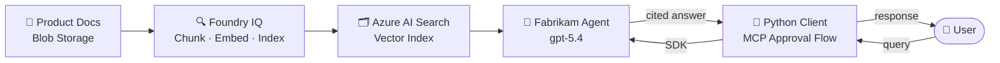

# Build knowledge-enhanced AI agents with Foundry IQ

https://learn.microsoft.com/en-us/training/modules/introduction-foundry-iq/



---

## Instructor Demo Guide

This demo shows how to create a Foundry project, build a knowledge base backed by Azure Blob Storage, connect an AI agent to that knowledge base via Foundry IQ, and test knowledge-grounded retrieval — end to end in the Microsoft Foundry portal and VS Code. The example scenario is **Fabrikam Audio**, a home-audio and home-theater retailer whose product catalog (speakers, soundbars, headphones) becomes the agent's knowledge base.

A complete, runnable client lives next to this guide in [`fabrikam-audio-py/`](fabrikam-audio-py/) — you don't need to clone the lab repo to run it.

**Estimated time:** 30–40 minutes

---

### Prerequisites

- Azure subscription with permission to create resources (AI Foundry, AI Search, Storage)
- Microsoft Foundry portal access at [https://ai.azure.com](https://ai.azure.com)
- VS Code with Python 3.13+ and the Foundry Toolkit for VS Code extension
- Azure CLI installed and signed in (`az login`)
- Grounding documents from [`assets/`](assets/) — 3 Fabrikam Audio product files to upload:
  - [`fabrikam-speakers.md`](assets/fabrikam-speakers.md)
  - [`fabrikam-soundbars.md`](assets/fabrikam-soundbars.md)
  - [`fabrikam-headphones.md`](assets/fabrikam-headphones.md)

This demo's Foundry project endpoint:

```
https://ai-103-demos-resource.services.ai.azure.com/api/projects/ai-103-demos
```

### One-time setup (Python client)

From the [`fabrikam-audio-py/`](fabrikam-audio-py/) folder:

```powershell
python -m venv .venv
.venv\Scripts\Activate.ps1
pip install -r requirements.txt
copy .env.example .env   # then edit .env if your agent or deployment name differs
az login
```

`.env` already points `PROJECT_ENDPOINT` at the demo project above and sets `AGENT_NAME=fabrikam-audio-agent`. Adjust those values if your portal names differ.

---

### Step 1 — Frame the knowledge problem (2 min)

Open a browser to the Foundry portal home page. Do not click anything yet.

> **Talking point:** "A plain AI agent only knows what it was trained on — no private docs, no current pricing, and it will hallucinate when it doesn't know something. Ask it the price of a Fabrikam CineBar 900 Pro and it will invent a number. RAG fixes this: the agent retrieves relevant chunks from your product docs first, then generates a grounded, cited answer. Foundry IQ is Microsoft's managed RAG layer built on Azure AI Search. Instead of every team building their own vector pipeline, you create knowledge bases once and any agent can share them."

---

### Step 2 — Create a Foundry project (3 min)

1. At [https://ai.azure.com](https://ai.azure.com), ensure the **New Foundry** toggle is on.
2. Select **Create a new project**.
3. Enter a project name (for example, `fabrikam-audio-demo`).
4. Accept or create a Foundry resource, select your subscription and resource group, choose a region, then select **Create**.
5. Wait for provisioning to complete.

> **Talking point:** "A Foundry project is the container for agents, deployments, and knowledge bases. Everything we configure here is scoped to this project."

---

### Step 3 — Create an agent (2 min)

1. On the project home page, select the **Build** tab.
2. Under **Agents**, select **Create agent**.
3. Name the agent `fabrikam-audio-agent`.
4. Note the default model deployed (for example, `gpt-5.4`).

> **Talking point:** "At this point the agent is just a model with no knowledge of Fabrikam's catalog. Ask it about the StudioLink 90 headphones and it has nothing. We'll fix that by attaching a knowledge base in the next steps."

---

### Step 4 — Add agent instructions (1 min)

In the agent's system prompt field, paste:

```
You are a helpful AI assistant for Fabrikam Audio, specializing in home-audio and
home-theater products such as speakers, soundbars, and headphones. You must ALWAYS
search the knowledge base to answer questions about our products or product catalog.
Provide detailed, accurate information and always cite your sources. If you don't find
relevant information in the knowledge base, say so clearly.
```

Select **Save**.

> **Talking point:** "Instructions are the contract between you and the agent. The key clauses here are: always search first, never answer from training data, always cite sources, and give a clear 'I don't know' when needed. Vague instructions like 'use the knowledge base' are not enough — you must be explicit."

---

### Step 5 — Upload sample data to Blob Storage (4 min)

1. Open [https://portal.azure.com](https://portal.azure.com) in a new tab.
2. Navigate to **Storage accounts** and create one (Standard LRS, same region as the project).
3. Inside the storage account, create a container named `fabrikam-audio`.
4. Upload the three files from the [`assets/`](assets/) folder into that container:
   - `fabrikam-speakers.md`
   - `fabrikam-soundbars.md`
   - `fabrikam-headphones.md`

> **Talking point:** "The knowledge base needs a data source. Azure Blob Storage is the simplest option — you drop documents in a container and Foundry IQ handles chunking, embedding, and indexing automatically. Supported formats include PDF, DOCX, TXT, Markdown, and HTML — these three product catalogs are Markdown."

---

### Step 6 — Create the knowledge base and connect it to the agent (5 min)

This step is scripted. From this folder, run the two scripts in order:

```bash
./provision.azcli          # AI Search + Storage + container + assets + RBAC
./provision-foundry.azcli  # knowledge source + knowledge base + MCP connection + agent
```

`provision-foundry.azcli` is where the knowledge is connected to the agent. It creates the `ks-fabrikam-audio` knowledge source over the blob container, builds the `kb-fabrikam-audio` knowledge base (embeddings with `text-embedding-3-small`, answer synthesis with `gpt-5.4`, `minimal` content extraction), then creates `fabrikam-audio-agent` with a Foundry IQ tool — the `knowledge_base_retrieve` MCP tool pointed at that knowledge base through a project connection. **That MCP tool on the agent is the connection.**

> **Portal alternative:** open the agent, expand **Knowledge**, select **Add > Connect to Foundry IQ**, then **Create a knowledge base** from the `fabrikam-audio` container (API Key auth, `minimal` extraction, `text-embedding-3-small`, `gpt-5.4`). The portal performs the same binding.

> **Talking point:** "Foundry IQ just ran a full RAG pipeline for us: it chunked the documents, generated embeddings, and built a searchable index in Azure AI Search — zero indexing code. The agent reaches it through an MCP tool, so one knowledge layer can serve many agents."

---

### Step 7 — Authentication (handled by the scripts)

`provision.azcli` sets the search service to **API key or Microsoft Entra** auth, and `provision-foundry.azcli` passes the search admin key and storage connection string into the knowledge base, so no manual key handling is needed.

> **Portal alternative:** if you built the knowledge base in the portal, go to **Knowledge > Manage**, select the search service, **Edit authentication**, and paste an admin key from the AI Search service **Settings > Keys**.

> **Talking point:** "Foundry IQ uses MCP — the Model Context Protocol — to expose the knowledge base to agents. The key gives it permission to query the search index on the agent's behalf."

---

### Step 8 — Test the agent in the playground (3 min)

In the Foundry portal playground, send these queries and point out the responses:

- "What speakers does Fabrikam Audio offer?"
- "Which soundbar supports Dolby Atmos?"
- "Tell me about the noise cancellation on the StudioLink 90 headphones."

> **Talking point:** "Notice the citations in the responses — references back to the source documents. The agent retrieved the answer from the catalog files, not from its training data. The Atmos question is a good one: only the CineBar 900 Pro supports Atmos height channels, and the agent should say the CineBar 500 does not. If I asked about a product we don't sell, it should say it doesn't know rather than fabricate an answer."

---

### Step 9 — Require approval for tool calls (2 min)

If you provisioned with `provision-foundry.azcli`, the agent's Foundry IQ tool is already set to require approval (`require_approval: always`) — skip to Step 10. The steps below apply only if you created the agent in the portal, where the knowledge tool runs without asking for approval by default. To let the client app review each knowledge lookup, switch the agent to require approval using the **Foundry Toolkit for VS Code** extension.

1. In VS Code, install the **Foundry Toolkit for VS Code** extension from the Marketplace (if not already installed), then sign in to Azure.
2. Under **Microsoft Foundry Resources**, choose **Set Default Project** and select your project.
3. Expand the project, then under **Prompt Agents**, select `fabrikam-audio-agent` to open the **Agent Builder**.
4. In the **Tools** section, find the **Foundry IQ** (knowledge base) tool, open its **...** menu, and in **Require approval before using tools** select **Ask for approval for all tools**. Save if prompted.

> **Talking point:** "The portal doesn't expose this toggle yet, so we set it from the Toolkit. Now every knowledge lookup raises an MCP approval request — which the Python client handles next."

---

### Step 10 — Run the Python client (5 min)

Switch to VS Code and the [`fabrikam-audio-py/`](fabrikam-audio-py/) folder. With the virtual environment active and `.env` configured (see One-time setup above), run:

```powershell
python agent_client.py
```

Send these queries:

```
What types of products does Fabrikam Audio offer?
```

When the MCP approval prompt appears, type `yes`.

```
What's the difference between the CineBar 500 and the CineBar 900 Pro?
```

```
Which headphones have the longest battery life?
```

```
How much do those headphones cost?
```

> **Talking point:** "The approval prompt is the MCP approval flow in action. Because the agent must call an external tool — the knowledge base — the SDK asks the user to approve that action. The client prints the tool name and arguments so you can see exactly what the agent is about to search. In production you would auto-approve or scope permissions, but during development this gives you full visibility. Notice the last question — 'how much do those cost' — works because the conversation keeps context from the previous turn."

The complete, runnable client for this step lives in [`fabrikam-audio-py/`](fabrikam-audio-py/) (`agent_client.py`, `requirements.txt`, `.env.example`).

Type `history` to print the conversation so far, or `quit` to exit.

---

### Step 11 — Highlight the shared knowledge advantage (1 min)

Point back to the Foundry portal Knowledge page.

> **Talking point:** "Right now `fabrikam-audio-agent` uses `kb-fabrikam-audio`. If we created a second agent — say a store-staff training assistant — we could attach the same knowledge base in seconds, with no extra indexing cost or maintenance. Update the catalog Markdown in Blob Storage and every connected agent benefits immediately. That's the core value of Foundry IQ: one knowledge layer, many agents."

---

### Demo resources (pre-created for this project)

These Azure resources were provisioned for the `ai-103-demos` project and do not need to be created during the demo. They are produced by the two provisioning scripts in this folder — `provision.azcli` (infrastructure) and `provision-foundry.azcli` (knowledge source, knowledge base, MCP connection, and agent). Skip Steps 2, 5, 6, and 7 — use the resources below instead.

| Resource        | Name                         | Endpoint / URL                                                                |
| --------------- | ---------------------------- | ----------------------------------------------------------------------------- |
| Foundry project | ai-103-demos                 | https://ai-103-demos-resource.services.ai.azure.com/api/projects/ai-103-demos |
| Azure AI Search | ai103demossearch (Free tier) | https://ai103demossearch.search.windows.net                                   |
| Storage account | ai103demosstorage            | https://ai103demosstorage.blob.core.windows.net/                              |
| Blob container  | fabrikam-audio               | pre-loaded with 3 Markdown product files                                      |
| Knowledge base  | kb-fabrikam-audio            | attached to the search service above                                          |
| Agent           | fabrikam-audio-agent         | in ai-103-demos, Foundry IQ tool, approval required                           |

Model deployments used:

- Chat: `gpt-5.4`
- Embedding: `text-embedding-3-small`

Credentials are in `.claude/deploy.config` (git-excluded). RBAC roles `Search Index Data Contributor` and `Search Service Contributor` are already assigned to the Foundry project managed identity.

---

### Summary

| What was demonstrated                         | Tool / Surface                                                                    |
| --------------------------------------------- | --------------------------------------------------------------------------------- |
| RAG concept and why it matters                | Conceptual framing                                                                |
| Creating a Foundry project and agent          | Microsoft Foundry portal (ai.azure.com)                                           |
| Uploading documents as a knowledge source     | Azure Portal — Blob Storage (`fabrikam-audio`)                                    |
| Provisioning Azure AI Search                  | Azure Portal — AI Search                                                          |
| Creating a Foundry IQ knowledge base          | Microsoft Foundry portal — Knowledge (`kb-fabrikam-audio`)                        |
| Testing grounded, cited responses             | Foundry portal Playground                                                         |
| Requiring tool-call approval                  | Foundry Toolkit for VS Code                                                       |
| Connecting via Python SDK + MCP approval flow | VS Code +[`fabrikam-audio-py/agent_client.py`](fabrikam-audio-py/agent_client.py) |
| Shared knowledge across multiple agents       | Conceptual wrap-up                                                                |

Students complete the full exercise themselves — using a different **Contoso camping gear** scenario — at:
https://learn.microsoft.com/en-us/training/modules/introduction-foundry-iq/7-exercise
